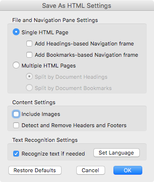

# Development notes

## Formatting

A few points for consistency:

* Inside `source/` is a .md file that has most of the garbage stripped out of it. Use this as the starting point.
* The title of the "Chapter" should be the only first level header (e.g. # Alignment)
* Classes should be one file each, e.g. `wizard.md`.
* The other headers should fall naturally under that first level header. This is mentioned because in the conversion process there were a lot of h3's that will need to become h2's.
* Tables should use html mark up. I know that you _can_ do tables with markdown but who wants that?
* If something is bold and italic, like the "Ability Score Increase." in the Race section, just make it bold. 

## When the SRD updates

In the event of an updated SRD document these are instructions on how to regenerate a file so that a diff can be run on it.

### How to export source PDF to the master HTML file

1. Open source PDF in Acrobat
2. File > Save
3. Change Format to HTML using the settings shown below.
4. Save out the file.

### How to strip out the cruft
The HTML exported above has a lot of extra information that we'd like to remove. There are many ways to do the following. What is documented here is my workflow.

1. Open the file in Sublime Text 2.
2. Use [Sublime-HTMLPrettify](https://github.com/victorporof/Sublime-HTMLPrettify) to restructure the code into something readable.
3. Remove everything except for the content of the `<body>` tag. This includes removing the `<body>` tag itself.
4. Edit -> Line -> Reindent
5. Find and Replace with the following regexes — `style=\"(.*?)\"` and `class=\"(.*?)\"` replacing them with nothing.
6. Find and Replace the following to fix tags — `  >` and ` >` for `>`. This closing the space left from the actions above.